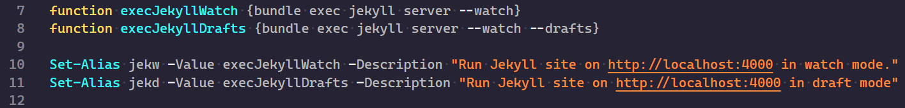
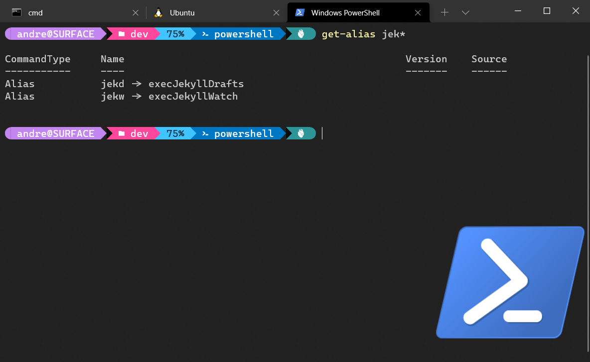

## tl;dr 

Mittels `Set-Aliase` lassen sich in PowerShell Kurzformen häufig genutzte Befehle erstellen. 

## Wo nutzen? 

*Aliase* sind eine gute Möglichkeit die tägliche Arbeit in PowerShell zu vereinfachen, insbesondere wenn immer wieder mühsam die gleichen Befehle getippt werden müssen. Ein Alias ist also nichts anderes als eine Kurzform eines Befehls. Wird der Alias in der PowerShell eingetippt, wird der Alias durch den hinterlegten Befehl ersetzt. Bei häufig genutzten oder komplizierten Befehlen lässt sich somit erheblich Zeit sparen. 

Aliase können zwar ad-hoc in der PowerShell definiert werden, nach dem Schließen der PowerShell sind diese beim nächsten Öffnen nicht mehr verfügbar.  

Geschickter ist es daher die Aliase im jeweiligen Profil zu definieren. Ob bereits ein Profil existiert, lässt sich 

```powershell
Test-Path $profile
```

herausfinden. Sollte hier PowerShell mit einem `false` antworten, liefert [Lowell Heddings eine gute Anleitung um ein Profil einzurichten](https://www.howtogeek.com/50236/customizing-your-powershell-profile/).

## Alias einrichten

Im konkreten Fall geht es darum, ein Alias für den Befehl 

```powershell
 bundle exec jekyll server --watch --drafts
```

zum lokalen Starten der Jekyll-Anwendung zu erstellen. Ich benötigen den Befehl zwar immer nur wenn ich etwas an der Web-Seite arbeiten, muss dann aber jedes Mal nachschlagen, wie er genau lautet. Wenn ich ihn dann benötigen, muss ich den Befehl immer wieder tippen. Also ein idealer Kandidat für ein Alias.

Das Ganze lässt sich mit dem Befehl [Set-Alias](https://docs.microsoft.com/en-us/powershell/module/microsoft.powershell.utility/set-alias?view=powershell-7.1) realisieren. 

Zunächst wird eine Funktion erstellt, die den Befehlt enthält, der ausgeführt werden soll.

```powershell 
function execJekyllDrafts {bundle exec jekyll server --watch --drafts}
```

Danach wird der Alias angelegt. 


```powershell
Set-Alias jekd execJekyllDrafts
```

Im Profile und etwas ausführlicher sieht das Ganze dann so aus: 



Ein Killerfeature ist `Get-Alias`, mit dem sich auch via Wildcards nach Aliasen suchen lässt.



Mit `jekd` bzw. `jekw` lässt sich somit der lokale Server einmal mit und einmal ohne die Entwürfe starten. 

## Tipp 

Am schnellsten lässt sich das PowerShell Profil am einfachsten direkt aus PowerShell anpassen. Hierzu einfach `notepad $profile` aufrufen. Ich selbst nutze hierfür [Visual Studio Code](https://code.visualstudio.com/) via `code $profile`. Syntax-Highlighting inklusive. 

## Fazit 

Mit Aliasen lässt sich eine Menge Tipparbeit sparen, insbesondere wenn es sich um Befehle handelt, die immer nachgeschlagen werden müssen. Gewusst wie, lässt sich hier einiges Automatisieren.  