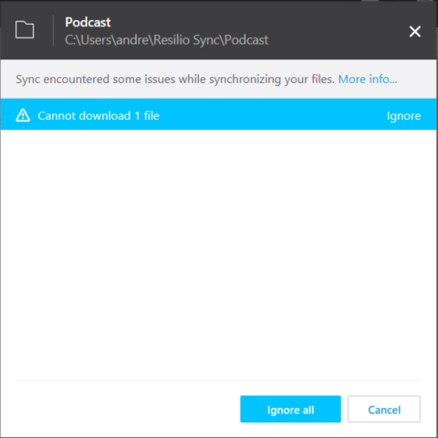

## tl;dr 

Liefert Resilio Sync unter Windows eine Fehlermeldung, dass ich Dateien nicht synchronisieren lassen, liegt es mit hoher Wahrscheinlichkeit daran, dass unterschiedliche Betriebssysteme (Windows, macOS) in der Peer-Liste vertreten sind. Das Problem lässt 

## Wirkung

Nach dem Einrichten eines neuen Ordners liefert [Resilio Sync](https://www.resilio.com/) eine Fehlermeldung, dass sich der Ordner nicht synchronisieren lässt. 

Die Lösung für das Problem findest sich auf den [Hilfeseiten von Resilio](https://help.resilio.com/hc/en-us/articles/204754729-Alt-Streams-and-Xattrs-in-Sync).

> Sync is capable of synchronizing xattrs. Xattrs are synchronized according to a whitelist, i.e. all listed xattrs are synced, while the rest is ignored. The whitelist is stored in the root of sync share in hidden .sync\StreamsList file . This is a regular text file, and can be modified - some lines added, some lines removed or commented out (with #). 

## Lösung

In zu synchronisierenden Ordner (des eigene Systems) im Ordner `.sync`die Datei `Streamlists`editeiren und sämtliche Zeilen, die mit `com.apple.` beginnen auskommentieren (mit `#`). 

Sobald die Datei gespeichert ist, sollte Resilio die Arbeit unverzüglich wieder aufnehmen und den Ordner synchronisieren. 

