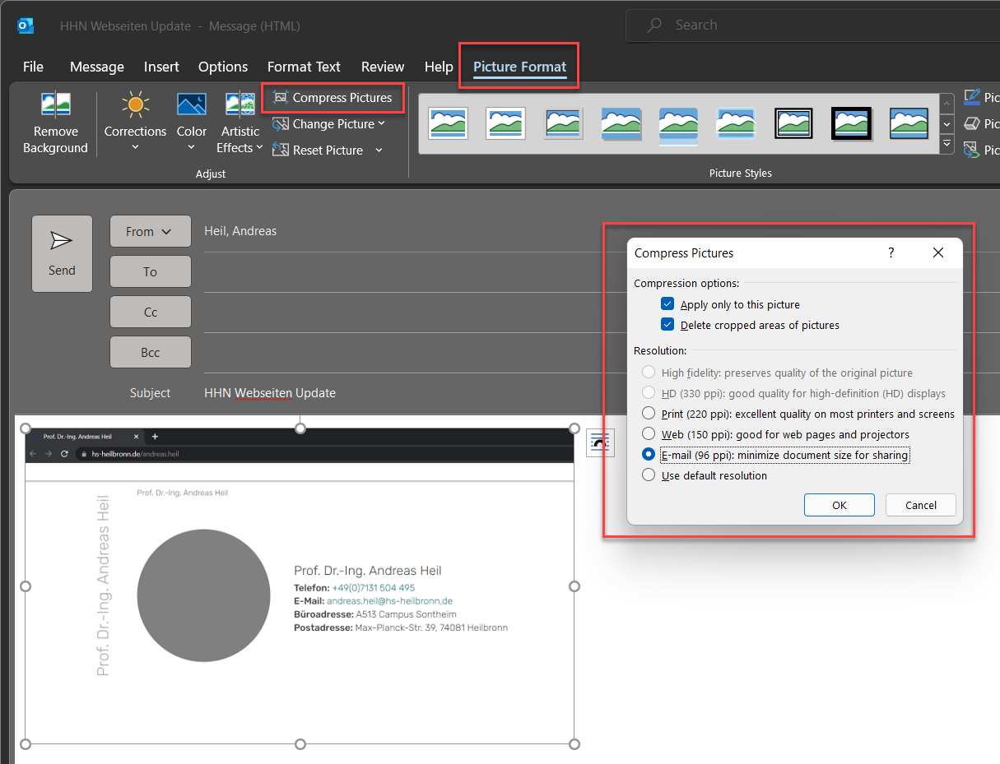
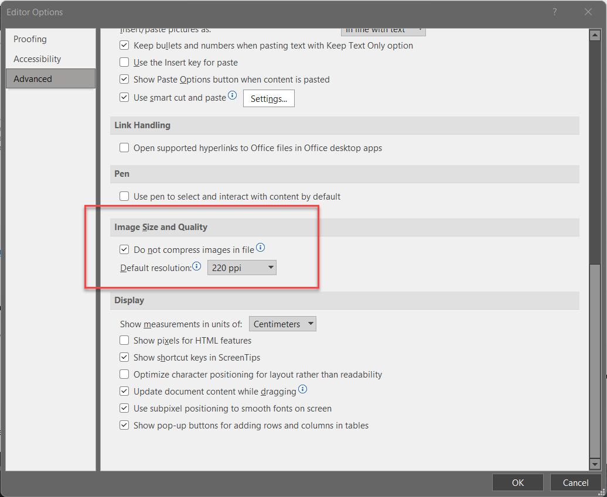

## tl;dr

Ist die E-Mail wieder einmal zu groß, lassen sich in Outlook eingefügte Bilder über *Picture Format* schnell und einfach komprimieren. 

## Vorab

Die folgende Beschreibung bezieht sich auf Outlook 365 (Version 2204) zum Zeitpunkt Mai 2022. 

## Wen interessiert schon die Größe 

Wer mit Outlook arbeitet kennt das Phänomen, E-Mail schreiben, Screenshots erstellen und via Copy and Paste in die E-Mail kopieren. Da kann einiges an Datenvolumen zusammenkommen. Eigentlich kein Problem, solange die Mail nur auf dem unternehmensinternen Exchange Server kursiert. Sobald die Mail jedoch das Unternehmensnetzwerk verlässt, oder wie in meinem Fall, zur automatischen Verarbeitung in ein Ticket-System weitergeleitet wird, kann aufgrund der Größe schnell die Annahme verweigert werden. 

## Bilder komprimieren - so einfach geht es

1. Beim Verfassen der E-Mail zunächst das Bild auswählen 
2. Nun erscheint in der Menüzeile den Reiter *Picture Format*
3. Hier *Compress Picture* auswählen
4. Im Dialog die entsprechenden Optionen auswählen und OK drücken.

Das ganze funktioniert dabei nur, wenn die E-Mail in einem eigenen Fenster verfasst wird. 

96 DPI ist dabei die beste Größe, also die kleinste Variante Bildes. [DPI](https://en.wikipedia.org/wiki/Dots_per_inch) geben dabei die Punkte pro Inch an - eigentlich ein Maß, dass nur beim Drucken Relevanz hat. Je weniger Punkte pro Inch, desto kleiner das Bild.

## Standardeinstellungen  

Unter *Outlook Options - Mail - Editor Options  Advanced - Image Size an Quality* finden sich die Standardeinstellungen. 

Diese sind normalerweise auf 220 DPI gesetzt. Wer sich - wie ich - öfters einmal Bilder von einem zum anderen Gerät schicken muss und dabei keinen Qualitätsverslust un Kauf nehmen möchte, kann hier die Kompression gänzlich deaktivieren. Wer wiederum Wert auf kleine E-Mails legt, kann hier die Kompression auch den eigenen Wünschen anpassen. 

## Fazit 
Bilder in Mails zu komprimieren macht auch im Zeitalter von hohen Bandbreiten oftmals noch Sinn. Die Einstellungen in Outlook sind hier jedoch gut versteckt.