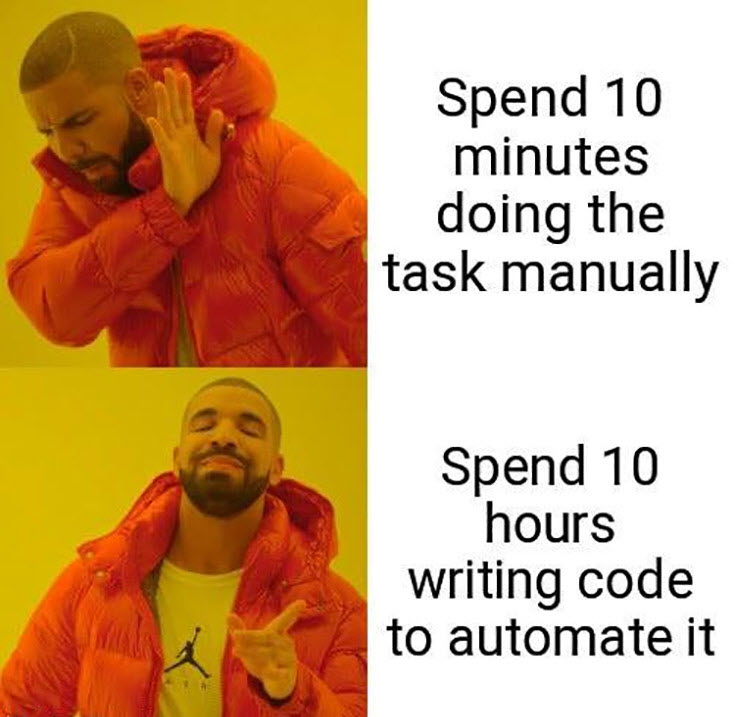

## tl;dr

Seit nun fast 6 Semestern habe ich alle relevanten Informationen zu meiner Person, zu meinen Veranstaltungen an der Hochschule im Hochschul Content Management System (CMS) gepflegt. Nun wird es Zeit umzuziehen. 

## Wieder und wieder 

Wer meine Vorlesungen besucht (hat) weiß, ich bin ein großer Fan davon Dinge zu automatisieren. Wenn ich es zum dritten Mal von Hand machen muss, sollte es wegautomatisiert werden.

Oder um es mit einem [Drakeposting](https://knowyourmeme.com/memes/drakeposting) auszudrücken:
 
{: width="350" }

Nun habe ich meine Hochschulseiten langwierig gepflegt, für jede Vorlesung eine eigene Seite angelegt, ausführliche Informationen zum Ablauf der Betreuung von Abschlussarbeiten, Informationen für Betriebe in Bezug auf Forschung, Kooperationen und Abschlussarbeiten, Publikationen, Lebenslauf etc. 

Nun kommet es in mehr oder weniger regelmäßigen Abständen vor, dass zentral am System etwas geändert wird. Eigentlich Dinge, die in jeder Organisation passieren. Einmal wurden meine Seiten aufgrund eines Systemupdates gelöscht und nun wurden die URLs geändert, was dazu geführt hat, das viele Links (vorübergehend) nicht erreichbar waren. 

Da das CMS ein redaktionelles System ist, sind hier auch wenig Möglichkeiten hinsichtlich der Automatisierung durch die Anwender möglich. Viel Maus, viel UI, viel Drag & Drop - alles Dinge, die dem Workflow einem Entwickler nicht gerade entgegen kommen. Dazu kommt, dass zu den Stoßzeiten die Anzahl der Editor:innen im System limitiert ist. D.h. schnelle Änderungen oder Korrekturen z.B. kurz vor einer Vorlesung sind nicht immer sichergestellt. 

Was aus meiner Sicht erwünscht bis notwendig ist: 

- Inhalte automatisch (vorzugsweise per Skript) einspielen
- Revisionssicherheit (vorzugsweise Git)
- Inhalte via Markdown schreiben
- Stabile Links (Permalinks)
- Weiterleitungen 
- Inhalte (zur automatischen Verarbeitung) als JSON ablegen 
- JavaScript (ja, wirklich)
- Das Ganze in einen Workflow eingebettet (der 100% über die Konsole gesteuert)
- Volle Kontrolle über alles (so ein Entwicklerding)

## GitHub Pages, Jekyll, VS Code

Am Ende läuft nun alles auf einen etablierten Workflow unter Zuhilfenahme von Git, GitHub Pages, Jekyll und Visual Studio Code. Einmal eingerichtet, gilt es nur noch Markdown-Seiten zu verfassen, einzuchecken und den Gang zur Kaffeemaschine zu tätigen. Auch die Vorlesungsseiten werden nach diesem Schema verfasst und gepflegt, hier nutze ich zusätzlich das auf Jekyll basierendes Projekt [Course-in-a-Box](https://course-in-a-box.p2pu.org/). Folien werden auf Basis von Reveal.js direkt eingebunden, hier waren einige Modifikationen erforderlich, damit ich die Folien ebenfalls direkt in Markdown schreiben kann (mehr dazu in einem späteren Post). 

## Was bleibt

Übrig bleiben wird vermutlich eine recht übersichtliche Seite auf dem Hochschul CMS - weniger Content mehr Links. Mit GitHub Pages kommt eine hohe Verfügbarkeit, was insbesondere für die Vorlesungsinhalte relevant ist. Anpassungen sind schnell erledigt und der gesamte Publishing-Prozess ist automatisiert. Ob ein Check-in geklappt hat, wird in einem [eigenen Discord Channel](https://discord.com/channels/674012582138347532/767817684125483008) gepostet und ob GitHub Verzögerungen oder andere Probleme hat, wird über [GitHub Status via Twitter](https://twitter.com/githubstatus) mitgeteilt. Dateien, die ich verlinke "werfe" ich in einen lokalen Resilio Ordner, der mit einem CDN (ok, eigentlich nur ein Web Server) synchronisiert wird. Ein manueller Upload auf den Server ist damit auch nicht notwendig. 

## Fazit 

Volle Kontrolle über den Workflow, bis auf das Verfassen von Inhalten beschränken sich die manuellen Tätigkeiten nun auf den Check-In mit Git. Darüber hinaus verwende ich eine ganze Reihe von Tools, die entweder in meinen Veranstaltungen genutzt werden und/oder meinen Student:innen bekannt sind. Und letztendlich ist der ganze Workflow ein tolles Beispiel für das Thema Automatisierung in meiner [DevOps](https://aheil.de/devops) Vorlesung.