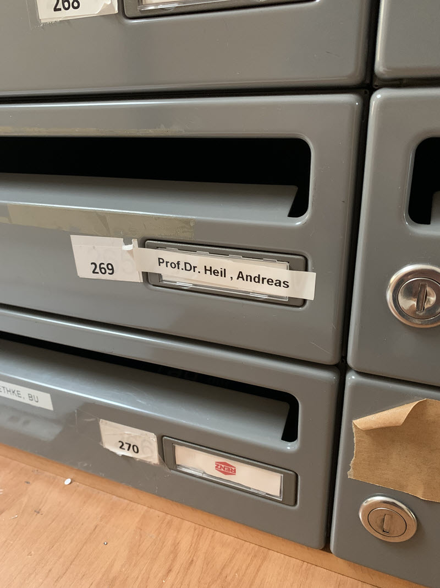

## tl;dr

Auf der Suche nach Stickern für Dein Laptop Cover? Dann hilft Dir der HHN Sticker Exchange. 

## Es war einmal 2020 - das C3stoc

2020 und 2021 waren recht schnöde Jahre. Kein Präsenzunterricht, nur vor dem Bildschirm sitzen, und keine Möglichkeiten auf Veranstaltungen Sticker abzustauben. In den beiden Jahren ging so gut wie nichts in Sachen Sticker. 

[@irgendwienet](https://twitter.com/irgendwienet) hatte mich noch kurz vor Pandemiebeginn mit Stickern vom [36C3](https://events.ccc.de/congress/2019/wiki/index.php/Main_Page) versorgt. Danach ist leider nicht mehr viel passiert. 

{: width="350" }

Zum Glück ist aus dem C3stoc das Sticker Operation Center entstanden und der [RC3 Sticker Exchange](https://stickeroperation.center/2020/10/26/c3-sticker-exchange/) wurde ins Leben gerufen. 

Die Idee ist ganz einfach: Man schickt einen frankierten Umschlag mit der Rücksendeadresse an den Rc3 Sticker Exchange und bekommt Sticker zurück. Oder man schickt zusätzlich Sticker mit dem Umschlag hin und bekommt Sticker zurück, oder man spendet einfach Sticker.

## HHN Sticker Exchange 

Der Idee des C3stoc folgend, starte ich ab sofort den Sticker Exchange an der HHN. Wie soll das funktionieren?

Ihr werft am Campus Sontheim einen Umschlag in den Briefkasten 269. In den Umschlag packt Ihr übrige Sticker und  einen zweiten Umschlag, vorzugsweise einen entsprechend passendend frankierten Maxi-Brief mit Eurer Rücksendeadresse. Sticker landen in Eurem Rücksendeumschlag und die zugeschickten Sticker wandern in den Sticker Exchange. 

{: width="350" }

Da Eure persönlichen Daten hier nicht verarbeitet werden, bekommen wir hier auch keine datenschutzrechtlichen Probleme. Eure Namen und/oder Adressen werden nicht weiter gespeichert oder verarbeitet.

Ab und an (in den Semesterferien kann es auch einmal länger dauern) werde ich die eingegangenen Sendungen abfertigen und zurückschicken. 

## Ich will nur Sticker haben, kann aber nichts beisteuern

Die Initiative basiert nicht auf einem Kongress o.ä. D.h. derzeit ist zwar ein ansehnlicher Sticker-Vorrat vorhanden, der würde aber relativ schnell zugrunde gehen, wenn wir keinen Nachschub erhalten. Daher spendet Ihr Eure übrigen Sticker dem HHN Sticker Exchange. Jede Spende zählt. 

## Ich will nur Sticker beisteuern

Super, davon lebt die Initiative. Sticker-Spenden von Firmen, Organisationen und Events schickt Ihr als Briefumschlag, Päckchen an:

Prof. Andreas Heil
Hochschule Heilbronn
Max-Planck-Str. 39
74081 Heilbronn

Das Sticker Exchange lebt von Euren Spenden. 