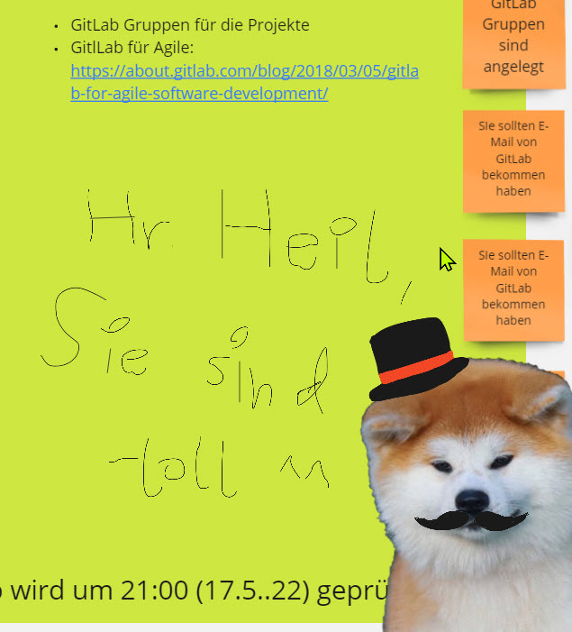
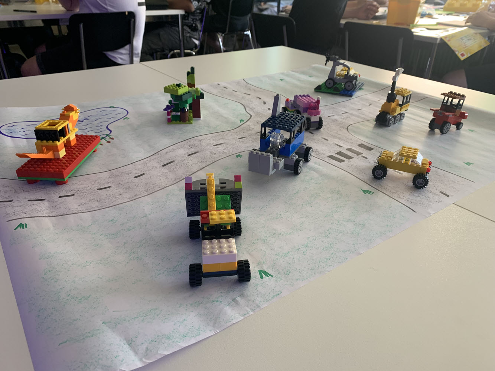
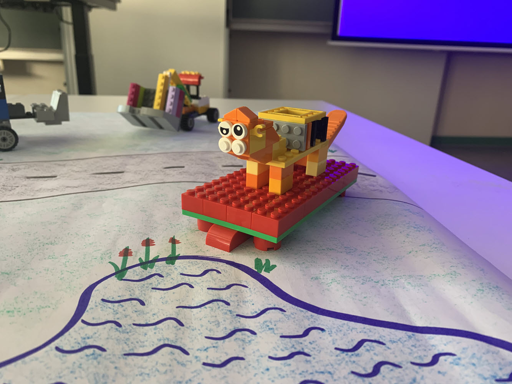
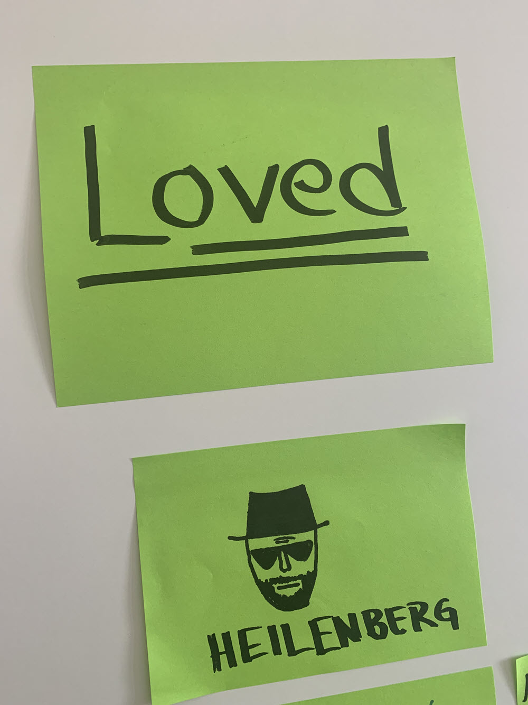

## tl;dr

Manchmal sieht man den Wald vor Bäumen nicht. Während ich agile Methoden lehre, bin ich höchst unglücklich mit den althergebrachten Lehrkonzepten. Warum also nicht agile lehren, oder besser noch agil studieren?

## Vorlesung und Klausur - Bequem und einfach

Vorlesungen und Klausuren sind einfach handzuhaben und mit minimalem Aufwand verbunden. Für den oder die Dozent:in. Einmal das Material vorbereitet, kann man jedes Semester die identische Spur abspielen. Nicht ohne Grund haben sich Overhead-Folien bei manchen Kolleg:innen bis in den heutigen Tag gehalten. Aber auch PowerPoint Slides werden ab einem bestimmten Zeitpunkt nicht mehr wirklich verbessert oder aktualisiert. Der Leistungsnachweis mittels Klausur ist ebenfalls bequem. Je mehr Faktenwissen abgefragt wird, desto einfacher ist die Klausur zu korrigieren. Eine der extremsten Ausprägungen ist der [SAT-Test](https://de.wikipedia.org/wiki/SAT_(Test)). Solche Test fördern das Bulimie-Lernen: Wissen in großen Mengen schnell und kurz vor der Klausur einprägen und in der Klausur - man verzeihe mir die Pietätlosigkeit - auskotzen. Diese sogenannte Leistung wird bewertet. Aus meiner Sicht eine nur bedingt nachhaltige Variante der Überprüfung des Lern- oder bessergesagt Lehrerfolgs. 

Kompetenzbasierte Klausuren sind hier schon eine andere Hausnummer. Individuelle Antworten werden bewertet. In Aufwand für den Dozierenden ist kaum zu übertreffen. Und doch, an meine Studienzeit zurückblickend, die einzigen Klausuren an die ich mich erinnern kann. Strategisches Marketing. Es galt eine einfach gehaltene Skizze von Lippen hinsichtlich der Marketingfähigkeit für das beworbene Produkt zu beurteilen. Eine DIN A4-Seite musste hier beschrieben werden.

## Semesterbegleitende Leistungen

Ein anderer Ansatz den wir an unserer Fakultät seit Jahren verfolgen: Ein großer Teil der Veranstaltungen besteht aus Abgaben, die während dem Semester eingereicht und benotet werden. Nur in zwei Fächern lasse ich noch Klausuren schreiben. Und dort werden diese nur mit 70 bzw. 50 Prozent in die Gesamtnot eingerechnet. Der Rest ergibt sich durch Gruppen- und Individualabgaben. Trotzdem der Seminar- bzw. Vorlesungscharakter bleibt erhalten. In der Vorlesung von 30 Student:innen sind vielleicht drei bis fünf, die aktiv(er) mitarbeiten. Der Rest konsumiert die Vorlesung eher passiv, isst, schaut sich Insta Reals an oder spielt Minecraft. Betrachtet man wiederum die Abgaben, sind es vielleicht drei bis fünf Student:innen, die die Aufgabe nicht oder nur mangelhaft bearbeiten. Selbst bei Themen, die in der Vorlesung nur peripher behandelt wurden, arbeiten sich die meisten Student:innen überraschenderweise gut in das Thema ein. Das gab und gibt mir zu denken. 

## Die Blockwoche - reorganisiert 

Auch dieses Jahr habe ich eine ganze Veranstaltung in unserer BLockwoche durchgeführt. *Projektmanagement und Tools*, bei mir überwiegend Scrum und die Vorbereitung auf das im darauffolgenden Semester anschließende Labor für Softwareprojekte und Project Skills. Wie schaffe ich es also die Studierenden für fünf Tage bei der Stange zu halten - so dass maximal viel "hängen bleibt" - während es für das Fach lediglich einen unbewerteten Schein gibt. Für alle Fachfremden: Im Prinzip muss nur eine ausreichende Leistung (d.h. eine 4,0) für den Erhalt des Scheins erbracht werden. Auch ich habe einmal studiert und weiß sehr genau, was das in Bezug auf die zu erbringende Leistung und die intrinsische Motivation mit sich bringt. 

Die Foliensätze habe ich für dieses Semester überwiegend ausgemustert. Sie werde nur bei Bedarf aufgelegt. Den Ablauf der Woche und der meisten Tage habe ich (versucht) auf einem Miro Board digital vorbereitet. So hatten die Student:innen die Informationen zu Hause und in den Veranstaltungen gleichermaßen zur Hand. Alle Teilnehmer:innen erhielten Zugriff auf das Board - was zu erstaunlichen künstlerischen Ergebnissen geführt hat. Ungewollte aber wirksame Ice Breaker, sozusagen. 

{: width="350" }

Vormittags bot ich ein Thema und und die Studierenden durften sich ein oder zwei Themen wünschen, dieses Jahr waren dies die Nutzung von Deployment Stages, A/B-Testing und Design Pattern. An zwei Tagen haben wir Workshops durchgeführt. Scrum mit Lego, die Teams haben so erstmals echte Scrum Zyklen erleben dürfen - und einen nicht zufriedenzustellenden Product Owner. 

{: width="350" }

{: width="350" }

Nachmittags erhielten die Gruppen Themen zum Erarbeiten und zum Vorstellen. Flexible Zeiteinteilung und selbstorganisierte Teams. Ich habe lediglich darauf geachtet, dass wir die Timebox, insbesondere bei Präsentieren einhalten. Auf typisches Nacharbeiten am Abend habe ich verzichtet. Das Feedback hat gezeigt, es hat auf jeden Fall motiviert. 

## Teilnahme und Mitarbeit

Trotz der anfänglich schleppenden Motivation (man wusste ja nicht, was da auf einen zukommt), haben sich alle mehr oder weniger aktiv eingebracht. In der morgendlichen Feedback-Runde musste ich nur am ersten Tag Student:innen aufrufen, ab dem zweiten Tag lief dies ok-isch. Die Mitarbeit war gut, es kamen Fragen, trotzdem es hätte mehr sein können.

## Retrospektive vs Evaluation 

Am Ender habe ich die [L4-Methode](https://www.atlassian.com/team-playbook/plays/4-ls-retrospective-technique) als Retrospektive vorgestellt und mit den Student:innen durchgeführt. Die Retrospektive haben wir dabei auf die gesamte Woche angewandt. Also nicht auf die einzelne Gruppe. Auch dies war möglich, die 4Ls haben zwar etwas länger beim Aufhängen gedauert, aber in recht wenig Zyklen waren die wichtigsten Actions klar. 

Im Anschluss habe ich im Rahmen der Qualitätssicherungsmaßnahmen an unserer Hochschule unserer typisches Evaluationsverfahren durchgeführt. Die Studierenden klicken sich dabei durch einen Fragebogen. 

## Fazit: Konstruktives Feedback vs Anonyme Bewertung 

Ein Blick auf die Evaluation zeigt, die Veranstaltung ist nur mittelmäßig angekommen. In einigen Punkten liege ich über dem Fakultätsschnitt, in anderen Punkten darunter. Verbesserungswürdig, möchte man sagen. 

Bei der 4L-Methode durften die Teams abwechselnd die 4 zuvor vorgestellten Sammlungen (Longed for, Lacked, Learned und Loved) bearbeiten, konsolidieren und immer wieder vorstellen.

Hier waren die Student:innen sehr ehrlich. Ich habe gelernt, was den meisten Student:innen gefehlt hat, aber auch am Ende, was dem Kurs am wichtigsten war. Das gleiche gilt für für Lacked. Die Raumorganisation ist dieses Jahr - schiefgelaufen. Wir hatten fest bestuhlte Räume und mussten fast jeden Tag wechseln. Aber am Ende war das nicht der wichtigste Punkt. In der Rubrik Learned konnte ich mitnehmen, was die Student:innen mitgenommen haben, das Thema nehme ich für kommendes Jahr mit. Und letztendlich in Loved haben die Student:innen aufgeführt, was Sie an der Veranstaltung am meisten gemocht haben. 

{: width="350" }

Am Ende nehme ich aus der Retrospektive viele Wertvolle Impulse mit um die Veranstaltung zu verbessern bzw. was in der Veranstaltung beibehalten werden sollte. Gerade diese Punkte gilt es nicht nur beizubehalten sondern noch zu optimieren. Die 4L-Methode hat mir so wertvollen Input geliefert, während die Evaluation im Nachgang betrachtet dieses Feedback nicht wirklich widerspiegelt. 

