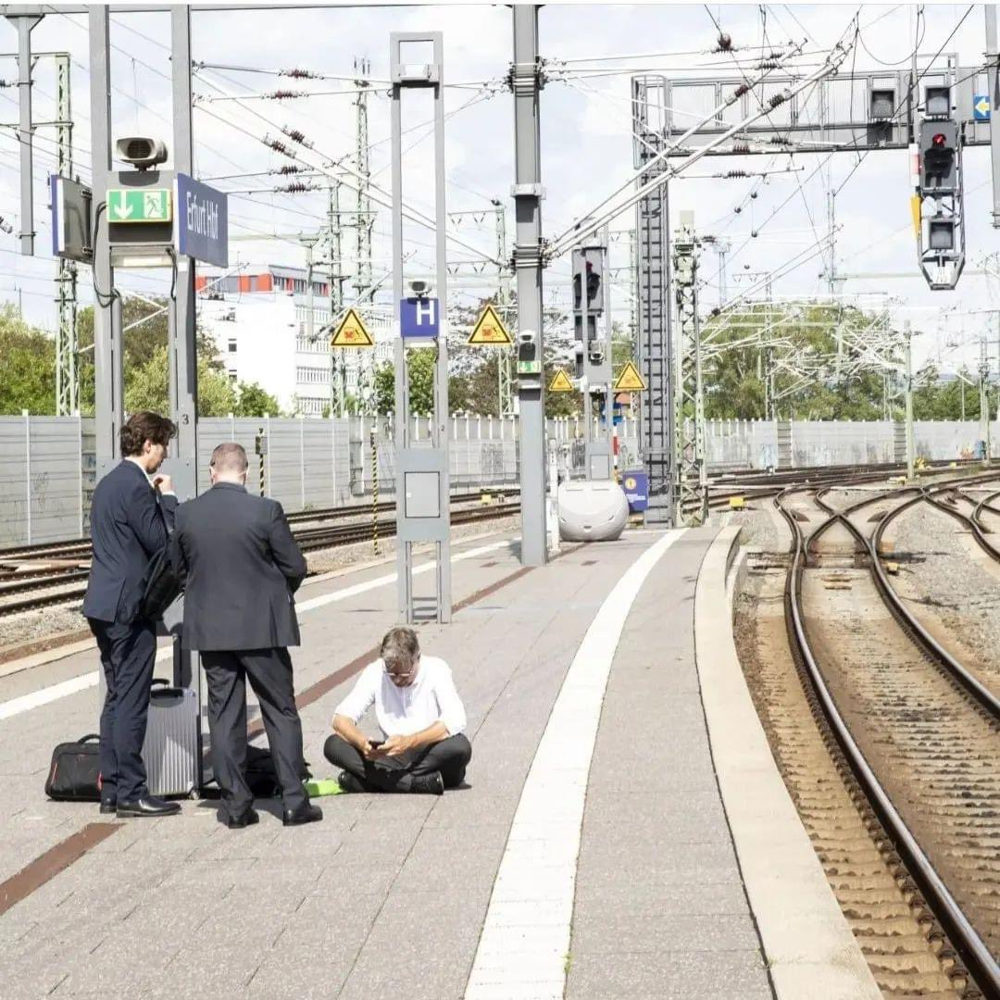

## tl;dr 

Fazit nach einem Semester ÖPNV. Zurück zum KFZ? Wenn es sich vermeiden lässt besser nicht. Das Auto ist keine Alternative.

## Sie auch hier?

Ab und an treffen mich einiger meiner Student:innen im Bus auf dem Weg zur Hochschule. Anfangs sind einige irritiert, der eine oder andere nickt höfliche und manch Student:in hat sogar schon das Gespräch gesucht. Ja, ich fahre mit öffentlichen Verkehrsmitteln. Soweit möglich. 

### Pendeln mit dem Auto = Lebenszeit verschwendet 

Bereits vor Corona-, Ukraine- und sonstigen Krisen hatte ich mit ein Monatsticket des hiesigen Verkehrsbetriebs besorgt und genutzt. Warum? Weil ich schlicht und ergreifend ungerne Auto fahre. Aus meiner Sicht absolute Verschwendung von Lebenszeit. In der man nichts Produktives machen kann. Klar, Besorgungen und die Kinder von A nach B bringen, sind ein Thema, aber täglich zwischen Wohnort und der Hochschule pendeln, das sind acht bis zehn Stunden wöchentlich. Oder aus einem anderen Blickwinkel: Ein voller Arbeitstag oder eine ganze Nacht durchschlafen.

### Weniger Flexibilität 

Ja, auf dem Land haben wir hierweniger Flexibilität. Ich kann nicht immer gerade wenn es mir danach ist ins Auto springen und losfahren. Auf der anderen Seite, zumindest während der Arbeitszeit fährt die Bahn bzw. der Bus zweimal die Stunde. Die Arbeit lässt sich so einrichten, dass es normalerweise irgendwie passt. 

### Entschleunigen 

Die Nutzung von öffentlichen Verkehrsmitteln erfordert etwas mehr vorausschauender Planung - und viel wichtiger - Entschleunigung. Es lässt sich eben nicht alles auf die Minute takten, und wenn einmal etwas schief geht, dann warte man. Übrigens ist es doch die gleiche Situation, wenn man im Stau steht. Mit einem Unterschied: Da man aktiv am STaut teilnimmt, hat man das Gefühl, dass man etwas macht, oder dass es zumindest langsam vorwärts geht. Ausgebildete Psychologen vermögen dieses Phänomen besser zu erklären. Aber selbst Minister Habeck vermag auf dem Bahnsteig zu warten. 

{: width="350" }

Bildquelle: Unbekannt, bei Anspruch auf Copyright bitte melden. 

### Und wenn dann doch etwas schief geht? 

Dieses Semester gab es exakt drei Vorfälle: Einmal fiel eine Bahn auf dem Weg zur Hochschule aus. Also auf die nächste Bahn gewartet. Das war ärgerlich, und der Kurs musste 20 Minuten warten. Das zweite Mal hat ein Autofahrer mittels verkehrswidriger Schienenüberquerung einen Unfall mit der Bahn verursacht. Totalsperrung. Übrigens auch auf der parallel verlaufenden Landesstraße. Wir sind dann zurück gefahren. Die Vorlesung wurde abgesagt. Und das dritte Mal war erst vergangene Woche. Eine Bahn ist liegen geblieben. Nach fast zwei Stunden war die Strecke geräumt. Die folgenden Bahnen waren dann - sehr sehr - voll. Das war einfach Pech. Dagegen stehen ca. 85 Hin- und Rückfahrten, die mehr oder weniger pünktlich waren. Mit dem Auto stand ich definitiv öfters im Stau - und war öfters genervt. 

### Lohnt es sich?

Ja, auf dem Land benötigt man immer noch ein Fahrzeug um zum nächsten Ort zu kommen. Am Ende ist es aber nur noch eine Tankfüllung im Monat, entgegen fünf zuvor. Das Ticket kostet 90€, also knapp 3€ am Tag. Das Job-Ticket wird dabei mit 25€ gefördert. Macht also 65€ für die Bahn. Definitiv günstiger als mit dem KFZ, selbst wenn man wie manche DiMiDo-Profs (ich bin keiner!) nur drei Mal am Tag führe. 

### Fazit 

Mit dem KFZ möchte ich eigentlich gar nicht mehr an die Hochschule fahren. Das Auto zum Pendeln ist keine Alternative. Als nächsten Schritt gilt es den Weg zur Bahn zu optimieren. 1,5 Tonnen dinosaurierverbrennendes KFZ zu bewegen, das macht kein Sinn - macht es wirklich nicht. Busverbindung gibt es nicht und Fahrrad ist im Land der 1.000 Hügel nur bedingt eine Option. Das [Delfast Top 3.0i](https://eu.delfastbikes.com/) wäre eine Möglichkeit, das in Deutschland jedoch nicht zugelassen werden kann, oder das neue [EMGo Scamper](https://emgo.technology/scramper-one-en/), das es hier noch nicht gibt. Beides im Übrigen Modelle aus der Ukraine. Also beides zum jetzigen Zeitpunkt nicht wirklich zugänglich. Vielleicht wird es ein [L6e oder L7e Leichtfahzeug](https://de.wikipedia.org/wiki/Leichtfahrzeug), was hierzulande jedoch nicht gefördert wird.  

P.S. Dieser Blogpost entstand in der Stadtbahn zwischen Karlsruhe und Heilbronn. Auch das wäre mit dem Auto nicht möglich gewesen. 
