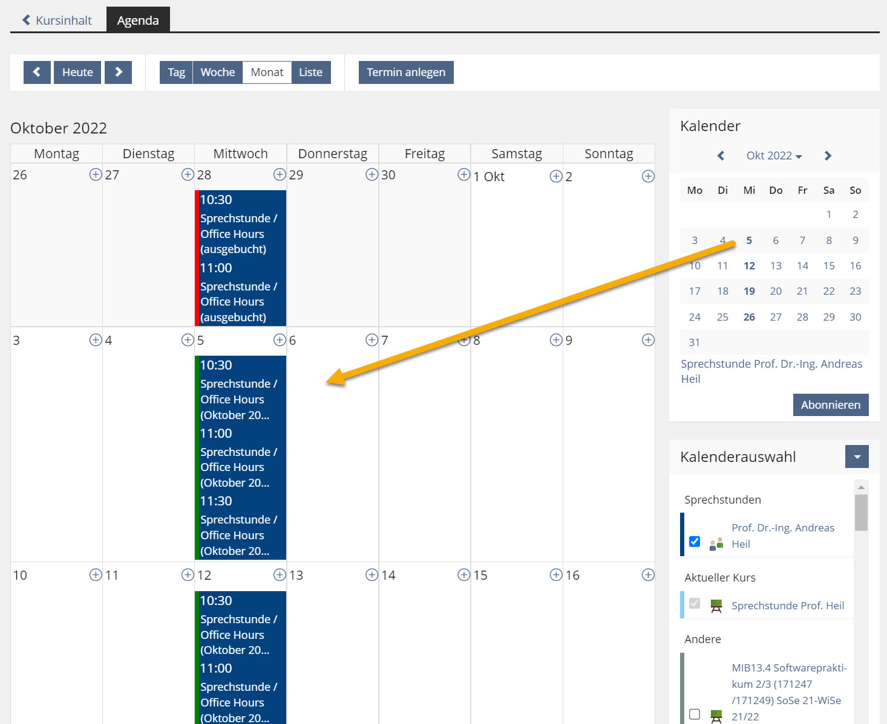
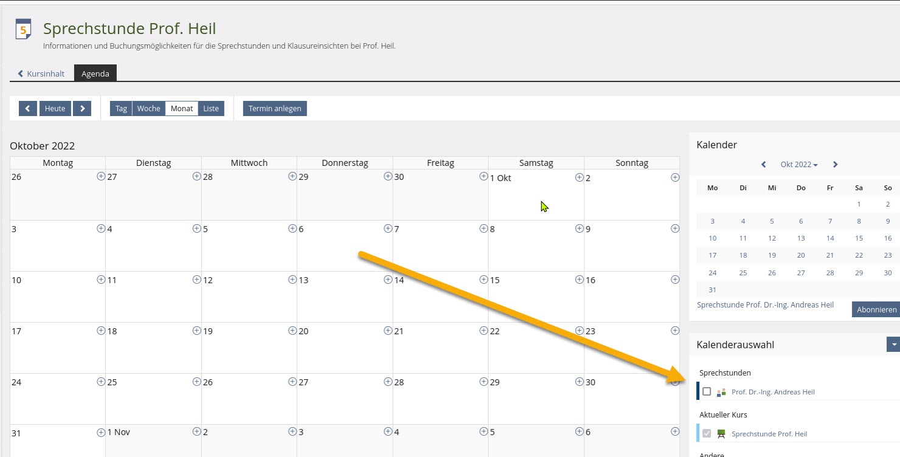

## tl;dr 

Ab sofort (Wintersemester 22/23) ist es möglich, bei mir Sprechstunden automatisch zu buchen. Lästiges E-Mail schreiben und Termine abgleichen entfällt somit. Student:innen finden die Anleitung zum Buchen von Sprechstundenterminen unter dem Punkt [Sprechstunden buchen mit ILIAS](#buchungen)

## Hintergrund 

Sprechstunden sind nicht nur da den Prof aufzusuchen, nachdem das Kind bereits in den Brunnen gefallen ist (schlechte Note, nicht bestandene Prüfung, Prüfungsanspruch verloren etc.), sondern ist ein Angebot an die Student:innen in den Dialog mit den Lehrenden zu treten, auch wen dies recht selten genutzt wird.

Aufgrund der wechselnden Stundenplänen und der pandemischen Lage in den vergangenen Semestern haben sich fixe Sprechstundentermine im Büro (für mich) als nicht zukunftsweisend erwiesen. 

Viele Kolleg:innen bieten Sprechstunden "nach Vereinbarung per E-Mail" an. Auch bei mir fragen Student:innen so nach einem Termin an. Lästiges Sichten des Kalenders und mehrmaliges E-Mail-Ping-Pong sind die Folge, bis ein Termin zustande kommt.

## Sprechstunden buchen mit ILIAS  
<a name="buchungen" />

Im [Hochschul-ILIAS](https://ilias.hs-heilbronn.de/) habe ich einen [eigenen Raum für meine Sprechstunden](https://ilias.hs-heilbronn.de/goto.php?target=crs_605637&client_id=iliashhn) angelegt. Grundsätzlich lässt sich auf den Kalender über jeden meine ILIAS-Räume zugreifen, allerdings gibt es einige Student:innen, die gerade zum Start des neuen Semesters keine Vorlesung mehr bei mir besuchen aber z.B. eine Klausureinsicht wünschen. 

Über den Kalender lassen sich die gebuchten und verfügbaren Termine anzeigen. Dann nur noch den passenden Termin auswählen und bestätigen.

{:width="600"}

Die gebuchten Termine werden in meinem Kalender synchronisiert und sind somit für mich zeitnah einsehbar. 

Um eine effizientere Planung zu ermöglichen müssen die Termine spätestens 24 Stunden vorher gebucht werden. Nicht gebuchte Termine können so anderweitig genutzt werden. 

## Troubleshooting 

Sollten für Sie keine Termine sichtbar sein, prüfen Sie ob die Checkbox für den Kalender "Sprechstunden" für meinen Eintrag gesetzt ist. 

{:width="600"}

