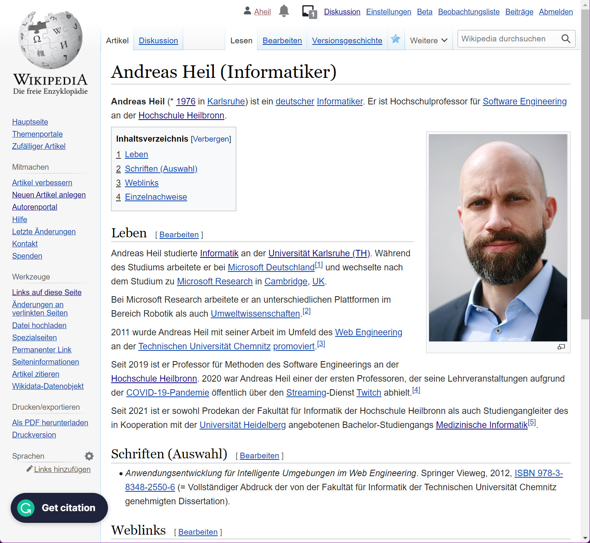

## tldr;

Während es an der Hochschule einen Cyberangriff gab, habe ich es am 03.11.2022 auf die Wikipedia geschafft. [Nuff said](https://www.urbandictionary.com/define.php?term=nuff%20said).

## Achievement Unlocked - Wikipedia Eintrag

Endlich geschafft. Dank Corona-Krise und ix Artikel scheint meine Person würdig zu sein auf der Wikipedia vertreten zu sein. Ich habe es gewagt den Entwurf meines Artikels in den entsprechenden Namensraum zu verschieben. Unter [Andreas Heil (Informatiker)](https://de.wikipedia.org/wiki/Andreas_Heil_(Informatiker)) gibt es also ab sofort einen neuen Wikipedia Eintrag (der glücklicherweise bisher nicht gelöscht wurde). Ihr könnte ja gerne den Eintrag mit relevanten Informationen ergänzen um das Löschrisiko zu minimieren.

## Cyberangriff bestätigt 

In der ersten Novemberwoche waren die Server der Hochschule nicht mehr erreichbar. Nach Medienberichten zu folge, als auch von Seiten der Hochschule bestätigt, gab es ein [Cyberangriff bestätigt](https://www.swr.de/swraktuell/baden-wuerttemberg/heilbronn/cyberangriff-durch-hacker-bestaetigt-hochschule-heilbronn-100.html). Aufgrund der laufenden Ermittlungen werden zunächst keine Angaben zum Vorfall gemacht. In die Ermittlungen ist neben der [Cybersicherheitsagentur Baden-Württemberg](https://im.baden-wuerttemberg.de/de/digitalisierung/cybersicherheitsagentur/cybersicherheitsagentur/) zwischenzeitlich auch das LKA einbezogen. Das Hochschulnetz ist vorerst vom Internet getrennt, Professoren sind nicht via E-Mail zu erreichen, der Präsenzunterricht findet jedoch wie gewohnt statt. Der Zugang ins Internet ist allerdings nicht möglich. Fristen für Abgaben und Anmeldungen werden in der Regel entsprechend verlängert. D.h. Entweder man arbeitet an der Hochschule und hat nur diverse internen Dienste zur Verfügung (sofern etwas zur Verfügung steht). Oder man arbeitet nicht dort und hat nur die externen Dienste zur Verfügung. Alles zusammen eine eher nicht zufriedenstellende Situation - vor allem für die Student:innen. Bis die kompromittierten Systeme wieder hergestellt sind und der Vorfall geklärt ist, wird dieser Zustand wohl anhalten.  

