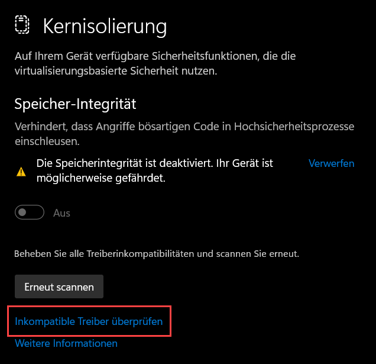
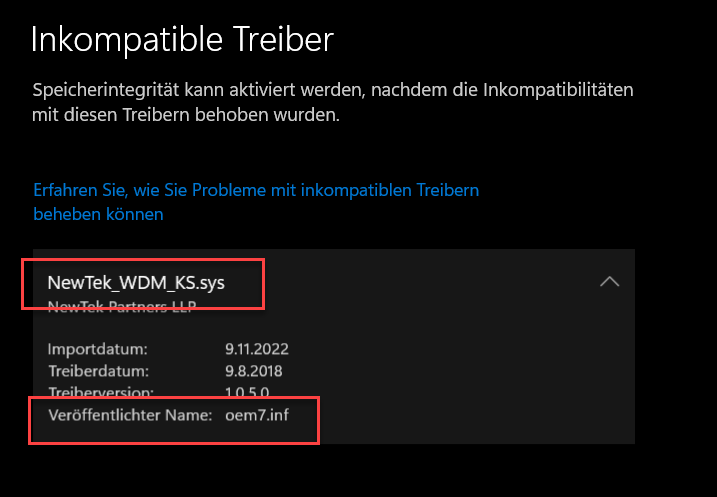
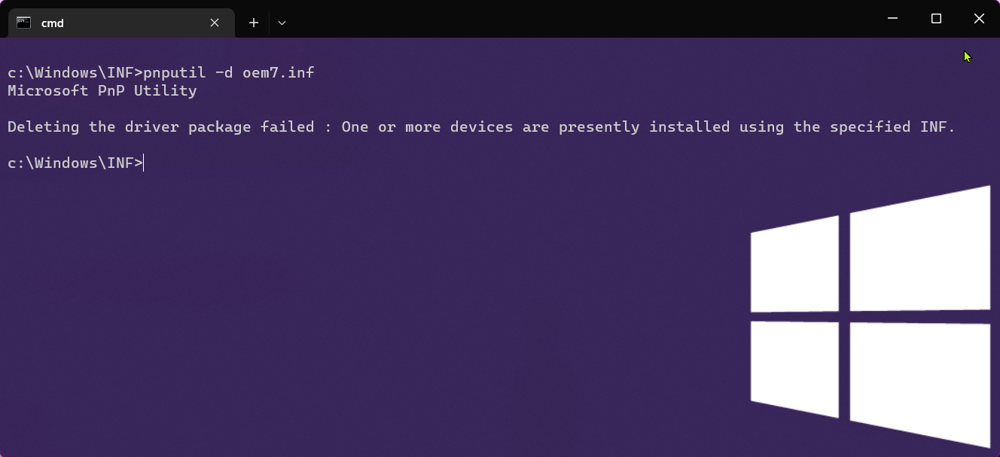
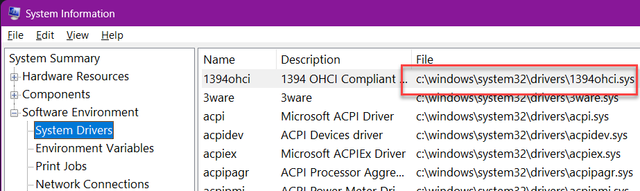
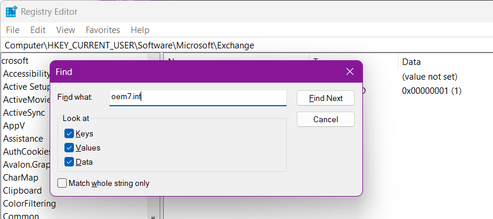
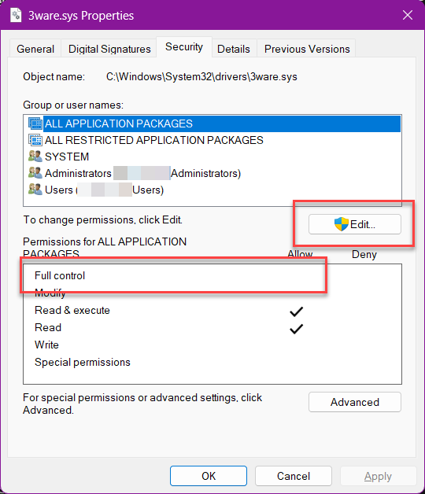
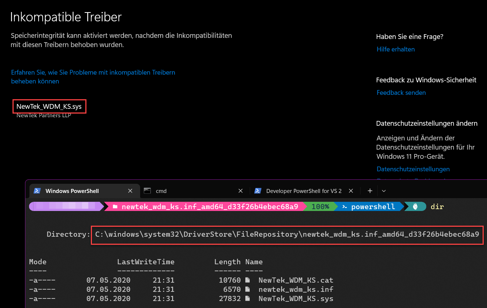
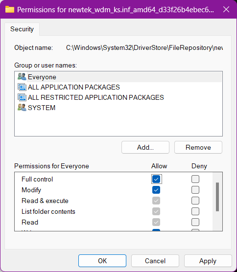
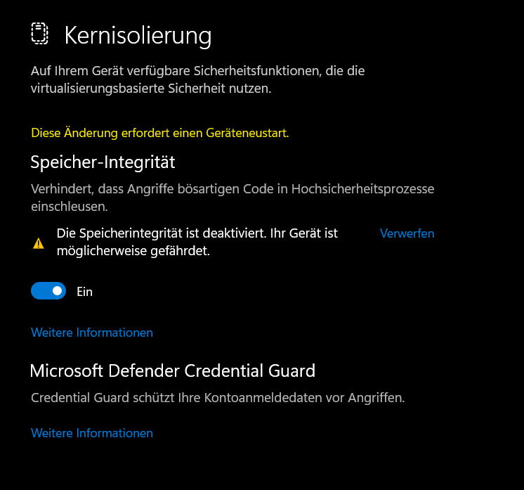

## tldr;

Aufgrund alter Treiber, die sich nicht (mehr) deinstallieren lassen, kann es sein, dass die Kernisolierung aufgrund nicht kompatibler Treiber bockt und nicht aktiviert werden kann. Mit ein paar Tricks lassen sich die Treiber manuell entfernen.

> WORKS ON MY MACHINE: In diesem Artikel werden einige Schritte beschrieben, die tief ins Betriebssystem eingreifen und ggf. dazu führen, dass der Rechner nicht mehr startet. Nachmachen ist ausdrücklich **nicht** empfohlen und geschieht auf eigene Gefahr. 

## Kernisolierung

Die [Kernisolierung](https://support.microsoft.com/en-us/windows/core-isolation-e30ed737-17d8-42f3-a2a9-87521df09b78) von Windows 11 (engl. core isolation) ist ein Sicherheitsfeature von Microsoft, dass mehrere Maßnahmen umfasst, Schwachstellen zu beseitigen, die Schadcode und bösartige Software ausnutzen könnten.


Was aber tun, wenn sich die Kernisolierung nicht aktivieren lässt (_Windows Sicherheit_ > _Gerätesicherheit_ > _Kernisolierung_)? Ursache hierfür dürfte ein nicht kompatibler Treiber sein. Treiber greifen tief ins Betriebssystem ein. Sollte ein Treiber nicht mit der Kernelisolierung kompatible sein, sollte dieser aktualisiert werden.



## Altlasten

In meinem Fall waren es Altlasten einer alten Version der NDI Tools, als auch ein Management Tool für Festplatten des Herstellers Wester Digital. Beide Treiber wurden nicht mehr genutzt und konnten über den _Gerätemanager_ in Windows (Win + R > `devmgmt.msc`) auch nicht mehr entfernt werden. 

Die Tools wurden vor Monaten deinstalliert und haben bei der Installation die alten Treiber - oder zumindest Teile davon im System zurückgelassen.

Einen ersten Hinweis findet man in der Liste der inkompatiblem Treiber. 



### Treiber via CLI löschen

Der einfachste Weg die Treiber zu deinstallieren (wir kennen nun ja die INF-Datei aus der vorherigen Meldung) ist die Nutzung von [PnPUtil](https://learn.microsoft.com/en-us/windows-hardware/drivers/devtest/pnputil).

```bash
pnputil.exe –d oem7.inf
Microsoft PnP Utility
Driver package deleted successfully
```

Sollte die funktionieren, kann man hier aufhören zu lesen, falls nicht (wie in meinem Beispiel unten) folgen ein paar Tipps zum weiteren Vorgehen.



## Dateien suchend und entfernen

### System Information

Die Treiber kann man vermutlich in der _Systeminformation_ unter _System Drivers_ (Win + R > `msinfo32.exe`) finden.

Hier bekommt man dern ersten Anhaltspunkt ob sich der Treiber un Benutzung findet, gestoppt ist btw. wie er gestartet wird. 



Bei gestoppten und auf manuell stehenden Treibern könnte es sich um solche Altlasten handeln. 

Treiber die laufen sollten über den _Gerätemanager_ gefunden werden und auch dort deinstalliert werden. 

### Weg mit den INF-Dateien

Die INF-Dateien enthalten alle Informationen des Treiberpackets. Diese Datei (hier im Beispiel `oem7.inf`) findet man unter `c:\windows\system32\INF`. Ein Blick in die Datei lohnt sich auf jeden Fall. Hier findet sich eigentlich alles, nach dem wir noch suchen müssten. Daher die Datei erst ganz zum Ende löschen.

### Registry (zer)hacken

Wer kennt es nicht. Einmal den Registry Editor anwerfen (Win + R > `regedit.exe`) und nach allem suchen was sowohl in der _Systeminformation_ als auch zuvor unter den inkompatiblen Treibern aufgelistet wurde. Treibernamen, Dateinamen etc. - hier alles dabei sein. Systematischer kann man die Schlüssel aus der INF-Datei nutzen.



> **WARNUNG**: Je nach Wagemut gilt es vorher ein Export der Registry zu machen um das System im Worst Case wieder herzustellen. Anleitungen dafür gibt es direkt bei [Microsoft](https://support.microsoft.com/en-us/topic/how-to-back-up-and-restore-the-registry-in-windows-855140ad-e318-2a13-2829-d428a2ab0692).

### Treiber-Dateien löschen

Unter `c:\windows\system32\drivers` finden wir die Treiber. Werden diese nicht mehr benötigt, können wir diese (vermutlich) ohne Bedenken löschen. Da die Dateien meist dem Installer gehören, ist dies selbst mit Administrator-Rechten nicht ohne Probleme möglich. 

Daher, Rechtsklick auf die Datei > `Properties` > `Security` > `Advanced`. 


Hier trägt man als neuen Besitzer seinen eigenen User ein 

Nun zurück und unter `Properties` > `Security` > `Edit` und dem eigenen Benutzer alle Rechte an der Datei geben.



`Ok` und die Datei mit einem Rechtsklick löschen. 

> **WARNUNG**: Wer willkürlich Treiberdateien aus dem System--Ordner löscht kann Gefahr laufen, dass der Rechner nicht mehr oder mit Problemen startet. Sollte nur einmal gesagt sein.

### File Repository löschen 

Nun ist das System zwar etwas aufgeräumter, aber die Kernisolierung wird sich immer noch nicht aktivieren lassen. Daher gilt es nun noch das `File Repository` aufzuräumen. 



Im Gegensatz zu den Dateien im `drivers`-Ordner ist hier zwar der User `SYSTEM` der Eigentümer der Datei, das Vorgehen ist jedoch das selbige. Die Datei übernehmen, dann entsprechende Rechte vergeben und löschen.  



## Ende gut 

Nach dem Löschen der entsprechenden Ordner aus dem `File Repository` unter dem Punkt Kernisolierung nochmals die Treber scannen. Der folgende Bildschirm sollte erscheinen.



Nun den Rechner einmal durchstarten und über ein "Bitchen" mehr Sicherheit freuen.

## Fazit 

Am einfachsten lassen sich nicht mehr benötigte Treiber über `PnPUtil` entfernen. Ist dies nicht mehr möglich können die Treiber, die die Kernisolierung verhindern oft auch manuell deinstalliert werden. Das beschrieben Verfahren hat zumindest bei mir für drei alte Treiberrückstände im System funktioniert. 

> WARNUNG: Vor einer solchen Aktion solltet Ihr unbedingt ein Backup Eures Systems durchführen. Kein Backup, kein Mitleid. 