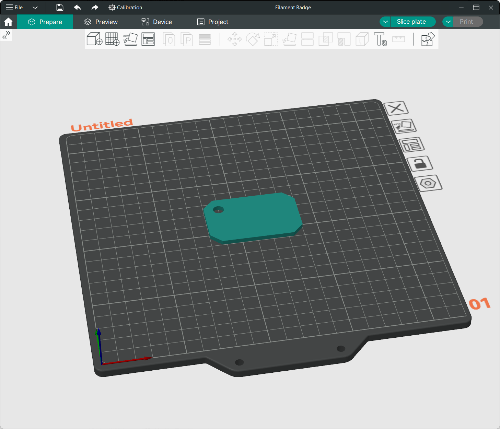
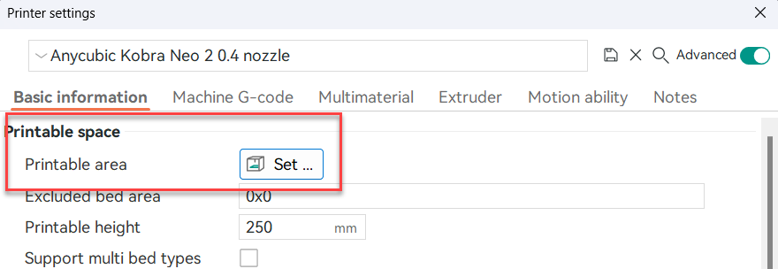
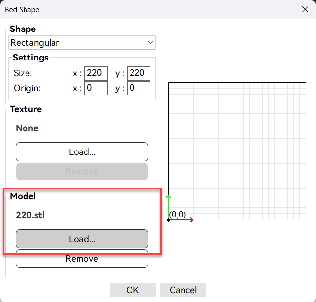

## tl;dr 

3D-Druck ist eines der [Rabbit Holes](https://de.wikipedia.org/wiki/Rabbit_Hole), an das ich mich bisher nicht heran gewagt hatte. Danke exzellenter Einweisung eines Mitarbeiters, habe ich mich nun durchgerungen, mich auch in dieses Thema einzunerden. Meine Erfahrung sammle ich in meinem "ultimativen" 3D-Druck Guide.

## Inhalt

- [tl;dr](#tldr)
- [Inhalt](#inhalt)
- [Welcher Drucker](#welcher-drucker)
  - [Mit welchem Drucker soll man anfangen?](#mit-welchem-drucker-soll-man-anfangen)
  - [Pros](#pros)
  - [Cons](#cons)
  - [Update (02/24)](#update-0224)
  - [Links](#links)
  - [Fazit](#fazit)
- [Quick-Start und Benchy](#quick-start-und-benchy)
  - [Benchy was?](#benchy-was)
- [Druckerprobleme](#druckerprobleme)
  - [Under Extrusion](#under-extrusion)
  - [Lockeres Druckerbett](#lockeres-druckerbett)
- [OrcaSlicer](#orcaslicer)
  - [Druckbett](#druckbett)
  - [Links](#links-1)

## Welcher Drucker 

### Mit welchem Drucker soll man anfangen? 

Eigentlich standen für mich immer nur der Prusa Mini oder der Ender 3/5 zu Diskussion. Aufgrund einer ausführlichen Diskussion mit [Marc](https://instagram.com/nr44mitreis) habe ich mich am Ende für eine Modell der Firma Anycubic entschieden. Nach dem Studium mehrere YouTube-Videos, in denen verschiedene Modell getestet wurden, habe ich mich für ein [Anycubic Kobra 2 Neo](https://wiki.anycubic.com/en/fdm-3d-printer/kobra-2-neo) entschieden. Der Drucker schien mir die wenigsten (für mich verkraftbaren oder nicht einschätzbaren) Nachteile und die meisten Vorteile zu kombinieren. Letztendlich war dann noch das Weihnachtsangebot ausschlaggebend. Im Falle, die Idee mit dem 3D-Druck würde nichts, wäre die Fehlinvestition zu verkraften. 

Ein paar erste Eindrücke zum Anycubic Kobra Neo 2:

### Pros 

- Günstiger Preis für Einsteiger 
- Für einen Laien, ein hervorragender Druck (mit dem original Filament)
- Sehr schnell - soweit ich das beurteilen kann
 Gerät ist in 15 Minuten montiert und benötigt quasi keine Nachjustierung
- Anycubic Slicer ermöglicht einen Quick Start

### Cons

- MicroSD-Karten Slot, man ist permanent damit beschäftigt die Karte hin und her zu tragen 
- Bedienfeld ist mit einem Drehrad - kein Touch - das geht doch besser
- Mit Anycubic Slicer war ich nach ca. 1 Woche am Limit

### Update (02/24)

- Die Sache mit der MicroSD-Karte nervt. Allerdings bin ich inzwischen auf OctoPrint umgestiegen und lade die Dateien über den Browser in den Drucker. Damit hat sich das Problem erübrigt.
- Mit dem Anycubic Slicer war ich recht schnell am Limit. Inzwischen bin ich auf OrcaSlicer umgestiegen. Hier gibt es quasi unendlich viele Möglichkeiten etwas falsch zu machen. Genau das habe ich gesucht.
- Das Bedienfeld mit dem Drehrad ist überflüssig, wird jetzt ales über den Browser erledigt.
- Der Listenpreis sind 230€, im Angebot habe ich das Gerät für 209€ erhalten. Aktuell kostet es im Angebot 198€. Also selbst beim Angebotspreis kann man etwas falsch machen.

### Links
- [Anycubic Kobra Neo 2](https://de.anycubic.com/products/kobra-2-neo)
- [Anycubic Kobra Neo 2 Wiki](https://wiki.anycubic.com/en/fdm-3d-printer/kobra-2-neo)

### Fazit

Beim ersten Drucker kann man IMHO nichts wirklich richtig und nichts wirklich falsch machen. Mehr Geld kann man später immer noch ausgeben, wenn man weiß, was man damit wirklich machen will.

## Quick-Start und Benchy 

Mein Drucker ist in vier Schritten zusammengebaut und perfekt justiert. Nach dem Anschluss kann mit den 10m Test-Filament direkt losgelegt werden. Auf der beigefügten Micro SD Karte sind einige Modell vorhanden, darunter auch das obligatorische [Benchy](https://de.wikipedia.org/wiki/3DBenchy). Das Out-of-the-Box Ergebnis des Druckers ist top und macht Lust auf Mehr. 

{:width="600"}

### Benchy was? 

Das Benchy ist das "Hallo Welt" des 3D-Drucks. Es hat vereint so ziemlich alles aus dem 3D-Druck, im Prinzip ein Referenzmodell, ein Benchmark. Daher auch der Name. Neues Filament? Benchy drucken, neue Software? Benchy drucken. Am Drucker was geändert? Benchy drucken. Am Ende hat man eine ganze Flotte von Benchys.

> 
💡 <strong>Pro Tip</strong>  Am besten die Benchys beschriften (Datum, Einstellungen, Filament etc.) - man kann daran gut die Veränderungen erkennen und nicht das auf Sd-Karte gelieferte Benchy-File nutzen, mit dem eigenen Slicer erstellen, da gibt es in der Tat Unterschiede.

## Druckerprobleme 

Die ersten Drucke waren top. Die Qualität berauschend und dann fing es an. Murphy's Law an allen Ecken und Enden. Meine bisherigen Probleme und Lösungen hier. 

Prinzipiell gilt: Am 3D-Drucker darf nichts wackeln und/oder lose sein. Das muss einem jemand sagen!

### Under Extrusion

Ganz fieses Problem: Die erste Schicht haftet nicht ordentlich auf dem Druckbett oder es gibt sichtbare Abstände zwischen den Schichten. 

{:width="600"}

Das Ganze läßt sich über die FLow Ratio einstellen. In dem Beispiel unten war die Flow Ratio auf 0,98 eingestellt. In OrcaSlicer findet man die Einstellung jeweils für das Filament. 

Es gibt hierfür Möglichkeiten der Kalibrierung um den besten Wert (zwischen 0,95 und 1,05 herauszufinden). 

### Lockeres Druckerbett 

Wenn das Druckbett (printing bed) lose ist, muss es nachjustieren werden. Das Druckbett bewegt sich, das heißt es sit auf Rollen gelagert. Wenn diese Rollen Spiel haben wackelt das Ganze. Bei kleineren Drucken fällt dies nicht auf. Bei größeren entstehen auf der einen Seite des Drucks vielleicht "Löcher" zwischen den Schichten, die erste Schicht ist nicht ordentlich auf dem Druckbett und auf der anderen Seite des Modells trifft der Drucker sogar den Druck. In meinem Fall war es nur eine Haaresbreite, das hat gereicht, daß ab einer Bestimmten Druckhöhe der Druck vom Druckbett gerissen wurde.

Bei einem Anycubic Drucker kann es recht einfach nachjustiert werden. Im Video wird gezeigt wie: 

<iframe width="560" height="315" src="https://www.youtube.com/embed/x74jm17kwzk?si=rrxzQhqXw-lhtGwa" title="YouTube video player" frameborder="0" allow="accelerometer; autoplay; clipboard-write; encrypted-media; gyroscope; picture-in-picture; web-share" allowfullscreen></iframe>

## OrcaSlicer

### Druckbett 

Das originale Anycubic Druckbett läßt sich recht leicht in OrcSlicer darzustellen.

{:width="600"}

In OrcaSlicer unter *Printer Settings*, im Reiter *Basic Information*, di *Printable area* auswählen. 

Dort unter Model das Model von Anycubic auswählen. Im Fall des Anycubic Kobra 2 Neo ist es das 220x220  Druckbett. Die STL-Datei `220.stl` ist bei mir dann z.B. unter `C:\Program Files\AnycubicSlicer\resources\profiles\Anycubic` zu finden. 

### Links
- OrcaSlicer: https://github.com/SoftFever/OrcaSlicer
- OrcaSlicer Discord: https://discord.gg/P4VE9UY9gJ 

