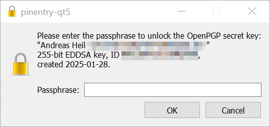

## tl;dr 

Versagt Git nach der Installation von GPG unter Windows mit der Medlung, es sei kein Secret Key vorhanden, obwohl man dieses angelegt hat, muss lediglich Git für GPG konfiguriert werden: `git config --global gpg.program "C:\Program Files (x86)\GnuPG\bin\gpg.exe"`. 

## Hintergrund

Nach der Installation von GPG für Windows, schlägt das Signieren von Commits mit folgender Meldung fehl: 

```bash
2025-01-29 09:01:54.491 [info] gpg: skipped "0B...C4": No secret key
gpg: signing failed: No secret key
error: gpg failed to sign the data
fatal: failed to write commit object
```

## Setup

Zunächst muss [Gpg4win](https://www.gpg4win.org/) installiert werden. Nach der Installation kann ein neuer Schlüssel mit 

```bash
gpg --gen-key
```

generiert werden. Zur Konfiguration des Git Repos wird nun der Schlüssel benötigt, diesen - bzw alle Schlüssel - kann man sich mit 

```bash
gpg --list-keys
```

anzeigen. 

```bash
PS C:\dev\iprog-exams> gpg --list-keys
[keyboxd]
---------
pub   ed25519 2025-01-28 [SC] [expires: 2028-01-28]
      0B...C4
uid           [ultimate] Andreas Heil <andreas.heil@example.org>
sub   cv25519 2025-01-28 [E] [expires: 2028-01-28]
```

Wir benötigen nun den Teil _0B...C4_, um das Git Repository zu konfigueren. 

Im Ordner, in dem sich das Git Repositoiry befindet kann man dieses nunr entsprechend configurien:

```bash
git config commit.gpgSign true 
git config user.name "Andreas Heil"
git config user.email "andreas.heil@example.org"
git config user.signingKey 0B...C4
```

Beim nächsten Commit sollte nun Git nach dem Password des Schlüssels fragen (hat man zuvor festlegen müssen). 

Geschiet dies nicht, und Git quittiert mit einer Fehlermeldung der Art 

```bash
2025-01-29 09:01:54.491 [info] gpg: skipped "0B...C4": No secret key
gpg: signing failed: No secret key
error: gpg failed to sign the data
fatal: failed to write commit object
```

kann Git den privaten SChlüssel nicht finden, da wir mittels `gpg --list-keys` jedoch verifizierten können, dass der private Schlüssel nicht gefunden werden kann, muss der Fehler an anderer Stelle liegen. 

Tatsächlich weiß Git noch nicht wo Gpg zu finden ist.

Mit dem Befehl 

```bash
git config --global gpg.program "C:\Program Files (x86)\GnuPG\bin\gpg.exe"
``` 
kann dies behoben werden und beim nächsten Check-In sollte nun nach dem Passwort gefragt werden. 

<center>



</center>

Damit alles funktioniert ist der Public Key noch auf dem Zielsystem zu hinterlegen. 

Den Public Key erhält man übrigens mit dem Befehl 

```bash
gpg --armor --export 0B...C4
```

## Wieviele Schlüssel? 

Anscheinend gibt es verschiedene Philosophien, wieviele Schlüssel man verwenden soll. Ich persönlich habe inzwischen auf jedem Rechner eine (mehrer) dedizierten Schlüssel. Einen für meinen dienstliche Arbeit und einen für private Check-Ins. So kann ich jedes Repo entsprechend steuern und Check-Ins können von mir immer nachvollzogen werden.

## Links 

- Gpg4win: [https://gpg4win.de/](https://gpg4win.de/)
- Git Tools - Signing Your Work: [https://git-scm.com/book/en/v2/Git-Tools-Signing-Your-Work](https://git-scm.com/book/en/v2/Git-Tools-Signing-Your-Work)
