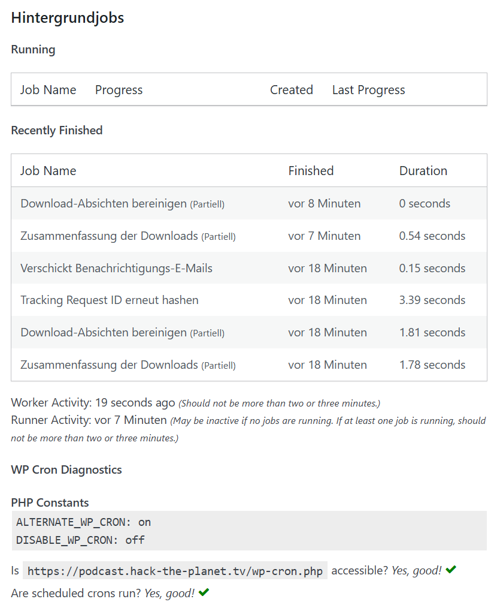

## TLDR;

Hängen die WordPress Cron Jobs inm Verbindung mit dem Podlove Plugin? Hast Du auch andauernd ein Timeout? Zwei Konfigurationsänderungen können das Problem lösen. Zumindest auf meiner Maschine.

## Hintergrund

Hier läuft ein WordPress Container `wordpress:latest` - und Pakete als auch Wordpress selbst und Datenbank-Installationen sind - selbstverständlich - auf dem aktuellen Stand. 

Die vermeidlichen Cron Jobs in WordPress sind jedoch keine Cron Jobs, sondern werden ausgeführt, wenn ein Request eintrifft. Das Problem hier: Inzwischen hängen alle Jobs und auch ein Neustart des Containers hilft nicht mehr. 

### Das WP-Config-Drama

Die erste Änderung findet in der `wp-config` statt. Die Datei liegt im Container unter `/var/www/html/wp-config.php`.  

```php
define('ALTERNATE_WP_CRON', true);
```

Die Zeile am Anfang der Datei einfügen, nicht am Ende, sonst greift anscheinend der Wert nicht. Hier passiert zu viel PHP-Voodoo. 

Eine unverbindliche Nachfrage bei Copilot, was denn diese Zeile auslöse, ergab folgende Erklärung:

> [...] bedeutet, dass eine alternative Methode für die Ausführung des WordPress-Cronjobs verwendet wird. WordPress führt Cronjobs aus, um zeitgesteuerte Aufgaben wie das Planen von Beiträgen, das Löschen alter Inhalte oder das Aktualisieren von Plugins auszuführen.

> Standardmäßig nutzt WordPress `wp-cron.php` und ruft es bei jeder Seitenanfrage auf. Wenn diese Methode jedoch aufgrund von Serverkonfigurationen oder anderen Einschränkungen nicht zuverlässig funktioniert (z. B. Blockaden durch Hosting-Anbieter oder Probleme mit HTTP), aktiviert die `ALTERNATE_WP_CRON`-Option eine alternative Arbeitsweise:

Das ist kein technischer Deep Dive, erklärt aber was in den Tiefen von WordPress passiert.

### Hat es Access?

Die Zweite Änderung findet in der `.htaccess` Datei statt. 
Zu finden unter `/var/wwwhtml/.htaccess` stehen dort bereits einige Einträge der WordPress Installation, die besser nicht angefasst werden sollten.

Folgender zusätzlicher Eintrag an erster Stelle der Datei kann vorgenommen werden.

```bash
Allow from x.x.x.x
Satisfy Any
```

Anstelle der x.x.x.x nutzen wir selbstverständlich die eigene IP-Adresse des Servers.

Und da wir auch hier wissen wollen, was diese Änderung bewirkt, fragen wir noch einmal bei Copilot nach:

> `Allow from x.x.x.x`: Erlaubt den Zugriff auf den Webserver nur für die spezifische IP-Adresse x.x.x.x Diese Einschränkung dient dazu, den Zugriff zu kontrollieren und nur autorisierte Nutzer von dieser Adresse aus zuzulassen.

> `Satisfy Any`: Diese Anweisung sagt Apache, dass eine von mehreren Bedingungen erfüllt sein muss, um Zugriff zu gewähren. Im Zusammenspiel mit `Allow from x.x.x.x` würde dies bedeuten, dass die Bedingung eines gültigen Zugriffs durch die genannte IP-Adresse alleine ausreicht. Falls andere Zugriffsbedingungen (z.B. Authentifizierung) definiert sind, ist es ausreichend, wenn eine davon erfüllt wird.

> 💡 Hintergrund: Diese Kombination ist nützlich, wenn Sie eingeschränkten Zugriff auf bestimmte Ressourcen haben möchten, z. B. zur Absicherung einer administrativen Seite. Allerdings ist es wichtig sicherzustellen, dass Sie mit `Satisfy Any` keine unbeabsichtigten Sicherheitslücken einbauen.

Gesagt, getan, scheint alles wieder zu funktionieren. Als Seiteneffekt hat sich die Performance der Instanz merklich verbessert, vermutlich, da es nun keine (oder weniger) der zuvor existierenden Timeouts aufgrund des fehlgeschlagenen Loopback-Zugriffs mehr gibt.

Ist alles so durchkonfiguriert, klappt es auch mit dem Cron Job.

{:width="600"}

## Works on my machine ¯\\_(ツ)_/¯

Wie immer gilt, es funktioniert auf meiner Maschine, bei meinem Problem mit meinem Setup. 

