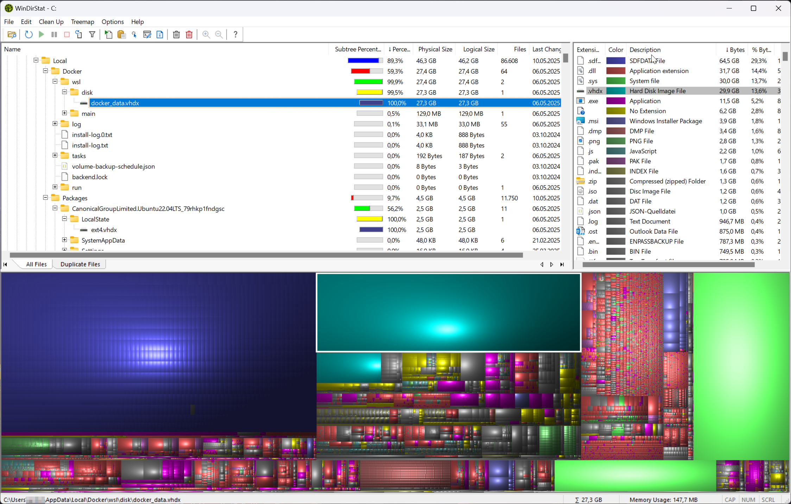
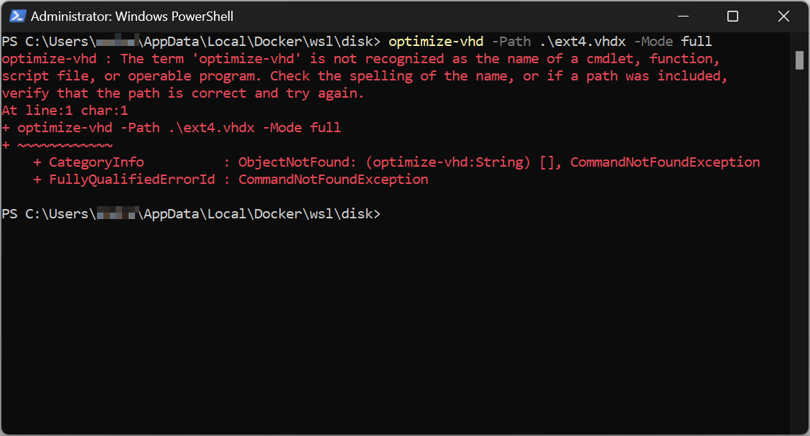
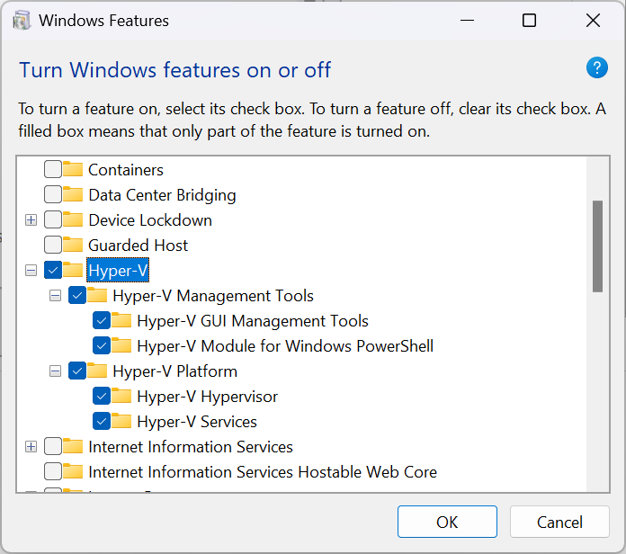
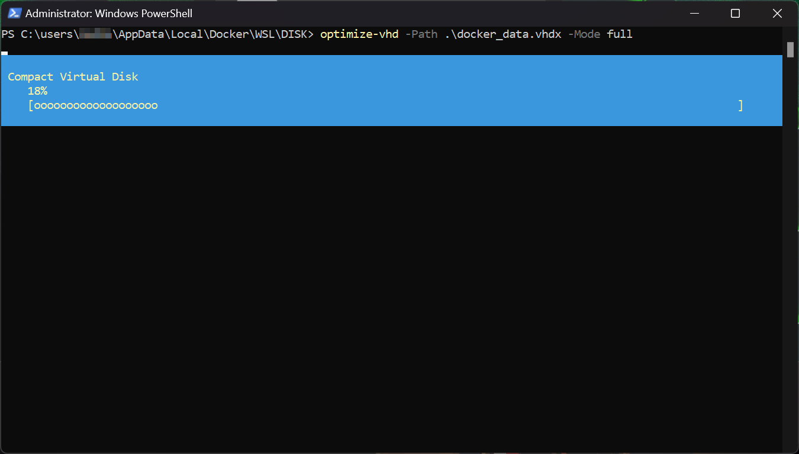

## tl;dr

Mittels den Hyper-V Tools in Windows und PowerShell, lasse sich aus dem Ruder gelaufene virtuelle Disks von Docker bzw. WSL komprimimeren und damit wertvollen Speicher freigeben.

## Speicher freigeben

Aufgrund meines Unterrichts arbeite ich sehr viel mit Docker, WSL und Abgaben, und so häufen sich über das Semester einige Altlasten an, die es am Semesterende auzuräumen gilt. Nach einiger Zeit scheint es aber, dass Docker - oder besser gesagt WSL keinen Speicher mehr freigibt. 

{: width="600" }

Laut [WinDirStat](https://windirstat.net/) handelt es sich bei mir knappe 24 GB - also ca. 10% meines Speicherts auf dem primären Laufwerk. 

Über die erestlichen in der übersicht ersichtlichen "größeren" Blöcke kann spekuliert werden - sie stehen derzeit aber nicht zur Disposition.

Nach etwas Recherche bin ich auf den [Artikel von Neil Cresswell](https://www.portainer.io/blog/reclaim-disk-space-by-compacting-the-docker-desktop-wsl-disk-image) gestoßen, der exakt das Problem beschreibt, und dabeiauf einen weiteren [Artikel von Nick Janetakis](https://nickjanetakis.com/blog/reclaiming-tons-of-diskspace-by-compacting-your-docker-desktop-wsl-2-vm) verweist. 

Das dort vorgeschlagene Vorgehen umfasst folgende Befehle nach dem starten von PowerShell als Administrator: 

```powershell
# Close all WSL terminals and run this to fully shut down WSL.
wsl.exe --shutdown

# Replace xyz with your Windows user name. This is where Docker stores its VM file.
cd C:\Users\xyz\AppData\Local\Docker\wsl\data

# Compact the Docker Desktop WSL VM file and you're done.
# NOTE: This may not work with Windows Home edition (read below).
optimize-vhd -Path .\ext4.vhdx -Mode full
```

`wsl.exe --shutdown`funktioniert noch wunderbar, aber schon beim zweiten Befehl gibt es Probleme. 

Der Docker Speicher liegt nun unter `C:\Users\xyz\AppData\Local\Docker\wsl\disk` - und auch das dritte Kommando verhilft nicht zum erhofften Erfolg. 

{: width="600" }

Also zurück ans Reisbrett und via 

- `Control Panel | Programs and features | Turn windows features on or off` 

den gesamten Punkt

- `Hyper-V`'

auswählen.

{: width="350" }

Nach der Installation sollte das System einen Neustart verlangen.
Danach den Befehl nochmals ausführen und nabn sollte einen ähnlichen Screen sehen. 

{: width="600" }

## Fazit 

Sobald einmal alles (korrekt) installiert ist, funktioniert es wunderbar. Die virtuellen Disks lassen sich bei mir um ca. 10% komprimieren. Das ist nicht viel, schaffen aber Luft, dass man an weiteren Lösungen arbeiten kann, wenn einmal der Speicher eng wird.